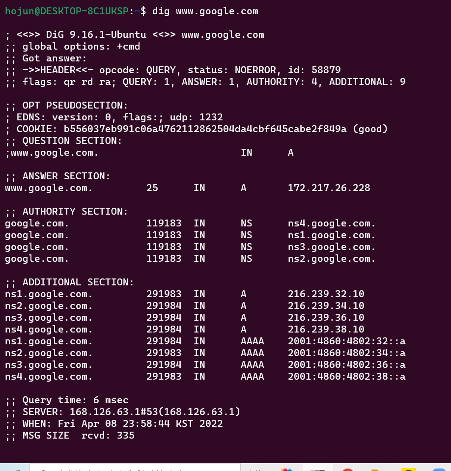

# IP주소를 DNS 서버에 조회한다
    브라우저는 url을 해독하거나 http 메세지를 만들지만 ,메시지를 네트워크에 송출하지는 않는다.
    메세지를 송출하는 기능은 os가 담당한다.이를 os에 의뢰할 때 os는 ip주소로 송신을 하기 때문에 IP주소를 조사해야 한다.
    그럼 이 IP는 어떻게 조사하는지 알아본다
### 사전지식
    라우터는 출발지에서 목적지까지 데이터를 어떤 경로로 전송할 것인지 결정한다.

    인터넷은 TCP/IP개념에 기초하여 만들어졌으므로 TCP/IP의 기본이 되는 개념부터 알아보자.
    TCP/IP 서브넷이라는 작은 네트워크를 라우터로 접속하여 네트워크가 만들어진다
    즉 여러개의 서브넷이 라우터를 통해서 전체 네트워크가 생성된다.

    
    그리고 XX동 YY번지라는 형태로 네트워크 주소를 할당한다.
    XX동에는 서브넷을 YY번지는 컴퓨터의 번호를 할당한다.
    동은 네트워크 번호이고 번지는 호스트 번호라고 한다. 이 둘을 합쳐서 IP주소라고한다.
## IP주소의 기본
    실제 IP주소는 32비트의 디지털 데이터로 1byte씩 점으로 구분하여 10진수로 표기한다.
    하지만 이러한 형태로는 어느 부분이 네트워크 번호이고 호스트 번호인지 구별할 수 없다.
    IP 주소의 규칙에서는 네트워크 번호와 호스트 번호의 두 가지를 합쳐서 32비트로 결정할 뿐 내역은 결정되어 있지 않다.
    즉 네트워크를 구축하는 사람이 직접 결정한다.
    그러므로 네트워크를 구축할 때 이 정보를 필요에 따라서 IP주소에 덧붙이고 이 정보를 '넷마스크'라고 한다.
    넷마스크 연산을 하는 부분이 아직 이해가 잘 안되서 다음에 다시 다뤄야겠다...

## domain과 ip를 구븐하는 이유
    TCP/IP의 네트워크는 IP로 상대를 특정한다. 따라서 IP주소를 모르면 상대에게 메세지를 전달할 수 없다.
    따라서 OS에게 송신 의로를 하기 위해선 IP주소를 알아야 한다.
    그럼 바로 ip주소로 입력하지 왜 도메인을 만들었냐고 할 수 있다.왜냐하면 "기억하기 쉬워서"이다. 
    그럼 그냥 ip주소도 사용하지 말고 이름으로 상대를 지정하자는 의견도 있을 것이다.
    IP주소는 4바이트에 해당하는 개수 빆에 없지만 이름을 사용한다면 수십바이트에서 최대 255바이트까지 가능하다.
    그러면 그만큼 라우터가 부하되어 데이터를 운반하는 과정에 더 많은 시간이 걸리면서 네트워크 속도가 느려진다.

    그래서 나온 방법이 사람은 이름을 사용하고 라우터는 IP주소를 이용 하는 방법이다.
    이름을 알면 IP주소를 알 수 있다는 원리를 이용한다.그 원리가 바로 DNS이다.

## Socket 라이브러리가 IP주소를 찾는 기능을 제공한다
    그럼 어떻게 이름으로 IP주소를 찾을 수 있을까??
    DNS서버에게  www.google.com을 아느냐고 물어보는 것이다.그럼 DNS서버는 알고있다면 IP주소를 알려주고 모른다면 
    다음에 질의할 DNS서버를 알려준다.
    여기서 DNS에게 질의를 하는 쪽을 dns resolver 라고 부른다.그리고 IP주소를 조사하는 것을 name resolution이라고한다 
    resolver는 소켓라이브러리에 들어있다.c에서는 gethostbyname("www.google.com")을 호출하여 ip주소를 받아오고 이를 os에게 넘긴다.

### 위의 과정을 살짝 살펴보자
    유저영역에서 gethostbyname("www.google.com")을 호출하면 os로 제어권이 넘어가고 resolver가 작동한다.
    resolver는 밑의 과정을 수행한다.
    1.조회 메세지를 만든다 (도메인을 아느냐??)
    2.그 조회 메세지를 DNS서버에 보낸다
    3.OS 내부에서  UDO메시지를 송신하여 DNS서버에 질의하고 응답을 받는다 
    4.resolver는 받은 응답으로 응답 메세지에서 ip주소를 추출하여 리턴해주고 제어권이 다시 애플리케이션으로 넘어간다
    5.리턴받은 ip로 실제 요청을 진행한다.
    
    참고로 DNS서버는 컴퓨터에 미리 설정되어있다.

dig www.google.com 를 사용해서 실제로 요청을 보았다.   
ANSWER SECTION을 보면 172.217.26.228 이라는 IP주소를 얻어왔다.(기특하군)
