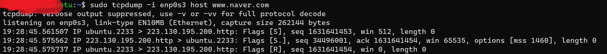
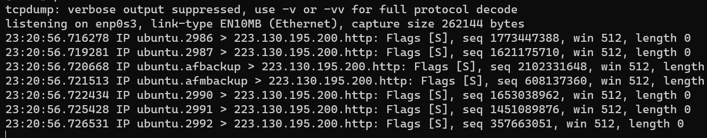

## 리눅스에서 TCP가 어떻게 다른 PC들과 소통하는지 TCP 패킷을 캡쳐해서 알아보자.

### TCP  3 HANDSHAKE
    TCP 프로토콜을 이용해서 데이터를 전송하기 전에 상대방과의 "접속"을 하는 과정이다.
클라이언트에서 서버로 접속한다고 가정하자        
                                 
클라이언트인 내가 서버인 naver로 접속한 패킷을 캡쳐했다.                                          

2. Client -> Server : SYN
   1. ubuntu.2233 > 223.130.195.200.http: Flags [S], seq 1631641453, win 512, length 0
   2. S flag : SYN 플래그 즉 접속을 요청
   3. 처음에 전송하는 "seq"필드는 임의로 생성된 난수이다.
   4. win : 연결 중에 버퍼링할 수 있는 수신 데이터의 양(bytes)이다. 
   5. length : TCP Option header의 길이. 
3. Client <- Server : SYN,ACK
   1. 19:28:45.575562 IP 223.130.195.200.http > ubuntu.2233: Flags [S.], seq 34496001, ack 1631641454, win 65535, options [mss 1460], length 0
   2. ACK : 내가 보낸 SYN 1631641453 에 +1 을 해서 다음에 받을 패킷은 1631641454 라고 알린다. 즉 잘 받았다는 역활을 수행한다.
   3. seq : 서버도 패킷을 보내고 잘 받았는지 확인해야 하기 때문에 seq번호를 나에게 전달한다
   4. win : 서버에서 연결 중에 버퍼링 할 수 있는 수신 테이터의 양
4. Client -> Server : ACK  
   1. 19:28:45.575737 IP ubuntu.2233 > 223.130.195.200.http: Flags [R], seq 1631641454, win 0, length 0
   2. R : reset 플래그이다. 비 정상적인 접속 끊기에 해당한다. 이 패킷을 보내는 곳이 현재 접속하고 있는 곳과 즉시 연결을 끊고자 할 때 사용한다.
          이 패킷을 받는 상대방이 받던 말던 연결을 종료한다.( 정상적인 접속이라면 여기서 계속 접속이 유지)
   3. seq :  서버가 마지막에 전송한 ack에 해당하는  1631641454 번호를 설정해서 패킷을 전송 한다.

### 궁금해서 ...
1. hping을 계속 보내봤다 
2. 어느 시점에 서버에서 응답이 도착하지 않았다. 분명 패킷은 전송되었다.
3.            
4. 이는 SYN 패킷의 요청이 5번 보내지고 서버에서 어떠한 ACK도 도착하지 않았기 떄문에 클라이언트에서 더이상 패킷을 보내지 않는다.
5. retransmit 갯수의 기본값이 5이다. 따라서 5번 보내고 대기 후 응답이 오지 않기 때문에 연결 시도가 종료된다.

