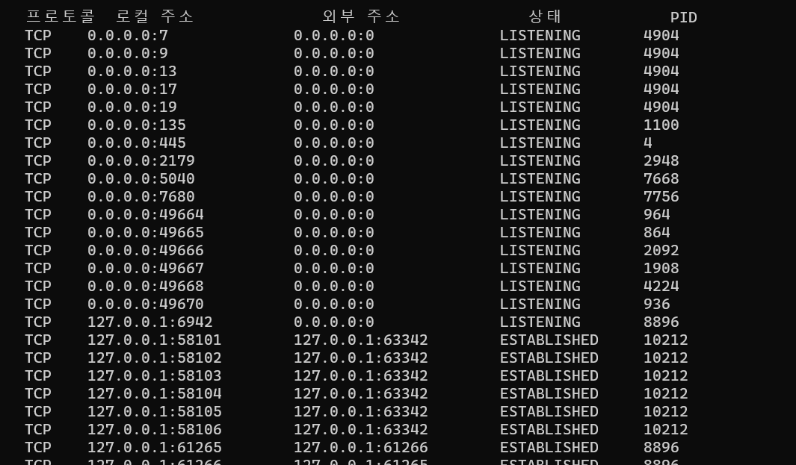

http 폴더에서 어떻게 메세지가 송신되는지 보았다.       
이제 OS 프로토콜 스택이 어떻게 송신을 하는지 살펴보자.  
1.소켓을 만든다    
2.서버에 접속한다    
3.데이터를 송수신한다.  
4.서버에서 연결을 끊어 소켓을 말소한다.

# 소켓을 만든다
### 프로토콜 스택의 내부 구성 
    계층으로 살펴보자(위에 있는게 상위 계층이다)
    
    애플리케이션
            네트워크 애플리케이션(웹 브라우저)
            소켓 라이브러리(resolver 포함)

    OS 
            TCP-UDP
            IP(ICMP,ARP)

    드라이버 소프트워에어
            LAN 드라이버

    하드웨어
            LAN 어뎁터

### 소켓의 실체는 통신 제어용 제어 정보
    프로토콜 스택은 내부에 제어 정보를 기록하는 메모리 영역을 가지고 있다.
    여기에 통신 동작을 제어하기 위한 제어 정보를 기록한다.(상대의 IP,PORT,통신상태,경과 시간)
    이 제어 정보를 기록한 메모리 영역이 소켓의 실체다
    
    프로토콜 스택은 이 제어 정보를 참조하면서 동작한다.
    실제로 소켓을 살펴보자
    
LISTENING은 상대의 접속을 기다리고 있다.   
ESTABLISHED는 접속 동작이 끝나고 데이터가 통신중이다.

### 소켓을 호출했을 때의 동작
    socket() 호출 시 커널은 의뢰에 따라 한개의 소켓을 만든다.
    이때 커널은 소켓 한 개 분량의 메모리 영역을 확보한다.그리고 초기 상태라는 것을 이 영역에 기록한다.(아직 어떠한 정보도 기입X,사용할 수 없음)
    소켓이 만들어지면 디스크립터를 애플리케이션에게 알려준다.디스크립터로 소켓을 식별한다.

# 서버에 접속한다
    소켓을 만들면 애플리케이션은 connect를 호출한다.그러면 서버측 소켓에 접속한다.이 과정이 어떻게 이루어지는지 살펴보자
### 접속의 의미
    위에서 살펴봤듯이 소켓을 만든 직후에는 초기 상태라 아직 사용할 수 없다.(소통하는 상대방이 누구인지,어느 포트인지 모른다)
    즉 접속 상대방의 IP나 포트번호를 커널에게 알리는 동작이 필요하다.
    이것이 접속의 의미중 하나이다.

    접속 요청을 받는 서버도 마찬가지로 소켓만 만들어서는 접속 상대방이 누구인지 알 수 없다.
    그래서 클라이언트에서 자신의 IP주소와 PORT 번호를 알려야 한다.클라이언트가 이런 정보를 서버에게 알려주면 
    서버측의 프로토콜 스택도 클라이언트의 정보를 기록한다.
    이것도 접속의 의미 중 하나이다.

    즉 접속 동작의 첫 번째 동작은 통신 상대와의 제어 정보를 주고받아 소켓에 필요한 정보를 기록하고
    이때 필요한 정보들이란 제어 정보라고 할수 있다.(IP,PORT번호 등등)    
    이러한 제어 정보를 기록하면 데이터 송수신이 가능한 상태가 된다.데이터를 송수신 할때는 데이터를 일시적으로 
    저장하는 메모리 영역이 필요하다.이 영역을 버퍼 메모리 라고 부른다.
    이 과정도 접속의 의미 중 하나이다.

### 제어 정보
    제어 정보에는 많은 정보가 들어간다.TCP헤더는 20byte 이상인데 여기서 각각의 정보들을 비트에 기록한다.
    제어 정보는 패킷의 맨 앞부분에 배치하고 이를 TCP헤더라고 부른다.
    클라이언트와 서버는 이 헤더에 필요한 정보를 기록하여 송,수신한다.

| 필드 명칭  | 설명                                                               |
|--------|------------------------------------------------------------------|
 | 송신처포트번호 | 이 패킷을 송신한 측의 프로그램의 포트 번호                                         |
 | 수신처포트번호 | 이 패킷을 받는 상대 프로그램의 포트 번호                                          |
 | 시퀀스 번호 | 이 패킷의 맨 앞 위치의 데이터가 송신 데이터의 몇 번째 바이트에 해당하는지를 송신측에서 수신측에 전달하기 위한 것 |
 | ACK번호  | 데이터가 몇 바이트까지 수신측에 도착했는지를 수신측에서 송신측에 전달하기 위한 것|
 |컨트롤 비트| 이 필드의 각 비트가 각각 통신 제어상의 의미를 갖는다.(ACK,SYN등등)|
등등 더 많은 옵션이 존재한다.
### 접속 동작의 실제
    접속 동작은 소켓이 connect(디스크립터,아이피,포트)를 호출하면서 동작한다.
    connect를 호출하면 커널의 TCP담당 부분에 전달된다.그러면  접속을 나타내는 제어 정보를 기록해서 TCP헤더를 만든다.
    이렇게 TCP헤더를 만들면 이것을 IP담당 부분에 건네주어 송신하도록 의뢰한다.

    그러면 IP담당 부분이 패킷송신 동작을 실행하고 네트워크를 통해 패킷이 서버에 도착하면 서버측 IP담당 부분은 이것을 받아서 TCP담당 부분에게 준다.
    이후 서버측의 TCP담당 부분이 제어 정보에 있는 수신측 포트번호에 해당하는 소켓을 찾아서 여기에 필요한 정보를 기록하고 접속 동작이 진행중이라는 상태가 된다.
    그리고 ACK라는 컨트롤 비트를 1로 만든다.이것은 패킷을 받은 것을 알리기 위한 동작이다.
    이렇게 만든 TCP헤더를 IP담당 부분에게 넘기며 전송을 의뢰한다.

    이렇게 응답을 전송받은 클라이언트는 TCP헤더를 조사하여 서버측의 접속 동작이 성공 했는지 확인한다.SYN비트가 1이면 접속이 성공이므로 
    소켓에 접속 완료를 나타내는 제어 정보를 기록한다.그리고 클라이언트도 서버가 보낸 응답을 잘 받았다는 것을 알리기 위해서 ACK를 1로 만든 TCP헤더를 전송한다.
    이걸 서버가 받으면 접속 동작은 끝이다.

    위의 과정을 거치면 비로소 데이터를 송수신할 수 있는 상태가 된다.즉 연결된 상태가 된다.
    한쪽이 CLOSE를 호출하지 않는  한 이 연결은 계속 존재한다.
    이렇게 연결 상태가 되면 커널의 접속 동작이 끝나므로 connect()가 끝나면서 애플리케이션을 제어할 수 있게 된다.

    
    
